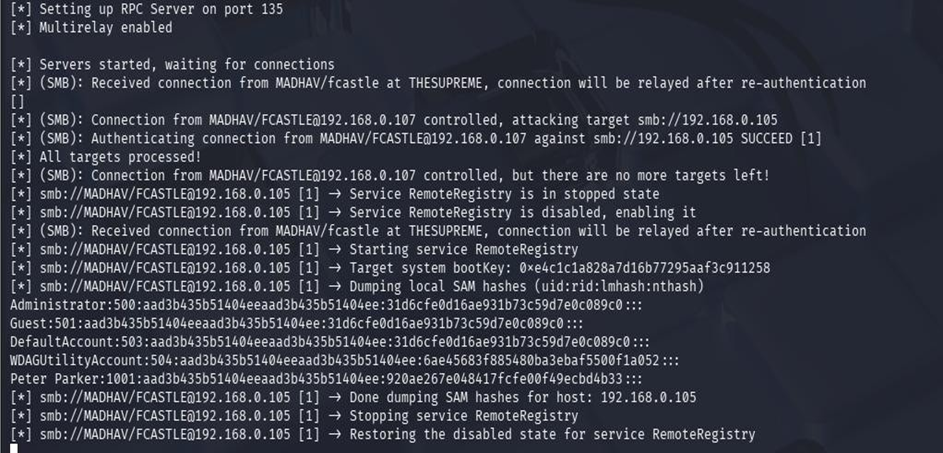
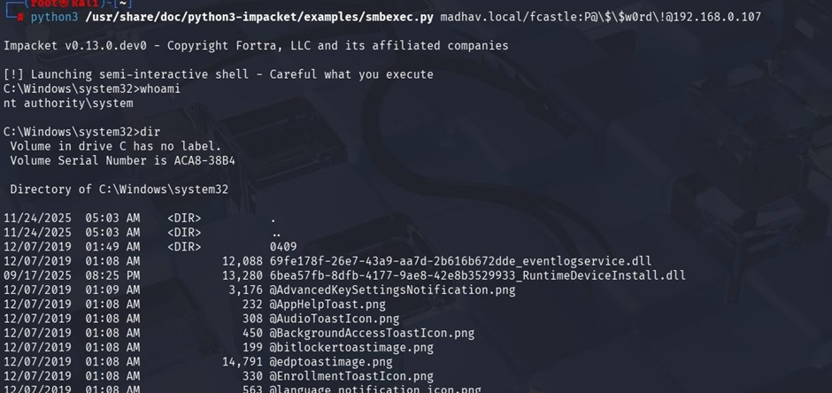
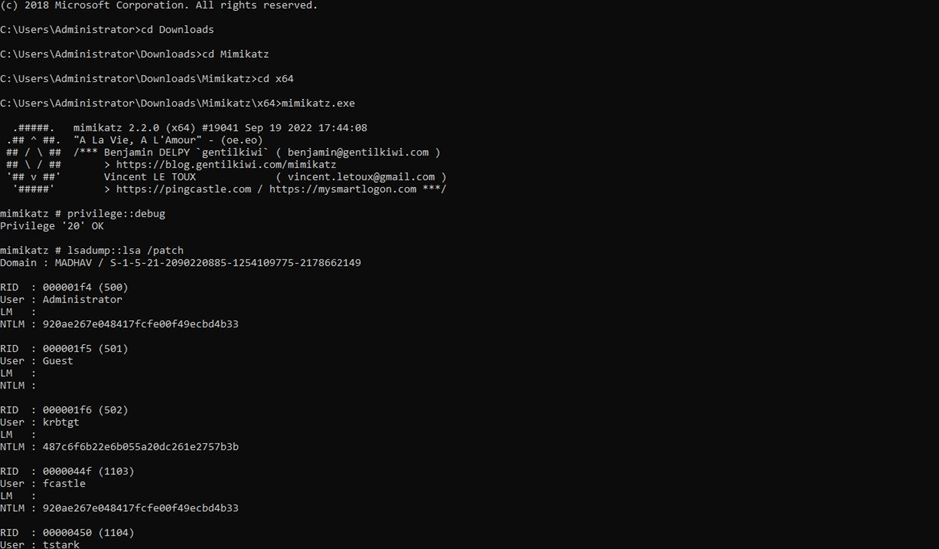
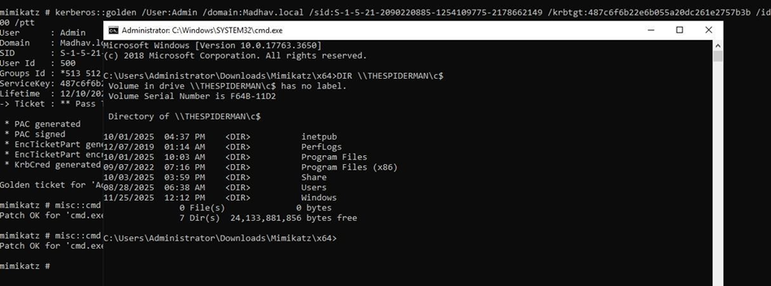

# Active Directory Attack Lab

## Overview

This project demonstrates a full Active Directory attack chain in a controlled lab environment, showing how weak configurations can lead to complete domain compromise.

---

## Lab Setup

* Domain Controller: Windows Server 2019
* Clients: Windows 10 machines
* Attacker Machine: Kali Linux
* Domain: madhav.local

---

## Attack Flow

Initial Access → Credential Capture → Lateral Movement → Privilege Escalation → Domain Compromise

---

## Attack Techniques

* LLMNR Poisoning (Credential Capture)
* SMB Relay (Credential Abuse)
* Remote Shell Access (Lateral Movement)
* IPv6 MITM & LDAP Relay
* Pass-the-Password & Pass-the-Hash
* Token Impersonation
* Kerberoasting
* URL File Attack
* Credential Dumping (Mimikatz)
* Golden Ticket Attack (Persistence)

---

## Tools Used

Nmap, Responder, Impacket, Mimikatz, Hashcat, Metasploit, CrackMapExec

---

## Key Learning

A single weak configuration in Active Directory can lead to full domain compromise when multiple attack techniques are chained together.

---

## Full Report

[Download Full Report](./AD-Attack-Lab-Report.pdf)

---

## Disclaimer

This project was conducted in a controlled lab environment for educational purposes only.

---

### LLMNR Poisoning (Credential Capture)

Captured NTLMv2 hash using Responder by exploiting LLMNR misconfiguration.

---

### SMB Relay Attack

Relayed captured credentials to target machine and dumped SAM hashes.

---

### Gaining Shell Access

Obtained SYSTEM-level shell using Impacket tools.

---

### Credential Dumping (Mimikatz)

Extracted plaintext credentials and NTLM hashes from memory.

---

### Golden Ticket Attack

Created forged Kerberos ticket for persistent domain admin access.
